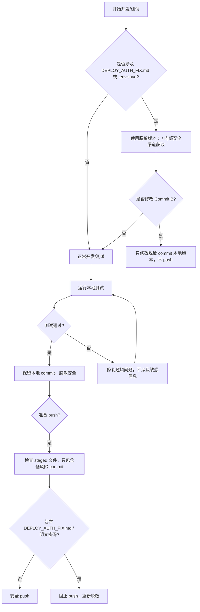

# Memory

## 2026-05-12: deep-research unknown skill production fix

- User reported the message/analyze flow broke after market intel routing changes.
- First bug was local/static frontend routing in `app/xueqiu-hot.html`: clicks went to `/app/`; minimal fix routes hot discussion to `/app/deep-research.html` and stock items to `/app/stock.html`.
- Second bug was production backend skill validation: `/home/ubuntu/finance-suite-web/static/app/deep-research.html` sends `skill_type: "deep-research"`, but `/home/ubuntu/finance-suite-web/app/skills.py` only registered `auction`, `industry`, `macro`, `mckinsey`, `meeting`, `stock`, `video`.
- Live `/api/analyze` backend is on the server in `/home/ubuntu/finance-suite-web/app/routers/api.py`, not in local `/Users/Zhuanz/finance-suite`.
- Production fix applied on 2026-05-12: added `SKILL_ALIASES` in `app/skills.py` mapping `deep-research`, `deep_research`, `deepResearch`, and `research` to existing canonical `industry`; added `normalize_skill_type()`; normalized `req.skill_type` at the start of `/api/analyze`.
- Backups on server: `app/skills.py.bak_codex_deep_alias_20260512001208` and `app/routers/api.py.bak_codex_deep_alias_20260512001208`.
- Restarted `finance-suite.service`; compile check passed; unauthenticated test now returns 401 instead of 400 unknown skill, proving skill validation is fixed.
- Detailed handoff for other agents: `docs/agent_handoff_deep_research_skill_alias_20260512.md`.

## 2026-05-12: market_intel Sidebar unblock patch

- User reported Claude got stuck while mapping `/api/analyze` and Sidebar intel routing.
- Root cause: two-repo boundary caused hesitation. `/api/analyze` lives in production `finance-suite-web`, but the local `finance-suite` repo can still prepare the MCP/server_scripts side without waiting for ECS entrypoint inspection.
- Applied local unblock patch in `/Users/Zhuanz/finance-suite`:
  - `scripts/market_intel.py`: `hot_stocks()` fallback chain now includes `zt_pool` after `hot_rank/top_gainers/hot_up`.
  - `server_scripts/intel_api.py`: added direct dict routes for `/api/intel/discussions`, `/api/intel/hot-stocks`, `/api/intel/watch-alerts`, `/api/intel/research`, `/api/intel/all`.
  - `mcp_server.py`: added MCP tools `research_digest(...)` and `market_intel(...)`, both wrapping outputs with `_wrap_response`.
  - `requirements.txt`: added `fastapi` and `flask` because `server_scripts/intel_api.py` / `watchlist_api.py` already depend on them; local `.venv` had been missing FastAPI.
- Validation:
  - `py_compile` passed for `server_scripts/intel_api.py`, `mcp_server.py`, `scripts/market_intel.py`, `scripts/research_digest.py`, `scripts/digest_llm.py`.
  - `pytest tests/test_digest_llm.py tests/test_research_digest.py -q` => core research suite `14 passed`.
  - Direct MCP calls passed: `mcp_server.research_digest(action="latest", limit=1, max_llm=0)` and `mcp_server.market_intel(modules="research", limit=1)`.
  - Direct route function calls passed for `intel_research(limit=1, max_llm=0)` and `intel_all(limit=1, modules="research")`.
- Updated agent handoff doc: `docs/market_intel_sidebar_handoff_20260512.md`.

## 2026-05-12: research Sidebar local E2E demo

- Claude correctly identified a "completion illusion": schema/tests/tools were green, but nobody had seen a real dehydrated research card in the browser.
- Built a local E2E demo that bypasses production `finance-suite-web`:
  - `scripts/research_demo_api.py`: minimal FastAPI app serving `app/index.html` and exposing `/api/intel/research` via direct `research_digest.latest(...)`.
  - `app/index.html`: added fourth tab `脱水研报`, `pane-research`, `fetchResearch()`, `renderResearch()`, and `routeResearch()`.
  - Localhost auth bypass: `app/index.html` skips the `fs_auth` redirect only on `localhost` / `127.0.0.1`; production domains still require login.
  - `requirements.txt`: added `uvicorn`.
- Validation:
  - Demo server runs with `.venv/bin/uvicorn scripts.research_demo_api:app --host 127.0.0.1 --port 8765`.
  - `curl http://127.0.0.1:8765/api/intel/research?limit=2&max_llm=1` returned real Eastmoney research items.
  - First observed item: `中国综合能源装备制造龙头，燃机&新能源构筑第二增长曲线`.
  - Without LLM key, `digest_status=fallback`; this proves the product loop is alive but the differentiation still depends on `OPENROUTER_API_KEY` or `ANTHROPIC_API_KEY`.
  - `py_compile` passed and `pytest tests/test_digest_llm.py tests/test_research_digest.py -q` => core research suite `14 passed`.
- Handoff doc updated: `docs/market_intel_sidebar_handoff_20260512.md`.

## 2026-05-12: ECS intel research route fact check

- Ran read-only SSH checks against `ubuntu@touziagent.com`.
- Production FastAPI entrypoint is `/home/ubuntu/finance-suite-web/app/main.py`; it includes `pages`, `api`, `admin`, `intel`, and `watchlist` routers.
- systemd service is `finance-suite.service`: `uvicorn app.main:app --host 127.0.0.1 --port 8000 --workers 4`.
- nginx `/api/` proxies to `127.0.0.1:8000`; `/app/` serves `/home/ubuntu/finance-suite-web/static`.
- Production `/home/ubuntu/finance-suite-web/app/routers/intel.py` has `/api/intel/research`, but it is a compatibility stub returning HTTP 200 with `_qc.status=failure` and error `research route is not connected to a live upstream yet`.
- Production `static/app/index.html` does not contain `脱水研报`, `fetchResearch`, or `pane-research`, so the 4-tab research UI is not deployed.
- Conclusion: production `/api/intel/research` being 200 does not mean live `research_digest` is deployed. It is a safe placeholder. Docs updated: `docs/backend_api_architecture_20260512.md` and `docs/production_stability_guard_20260512.md`.

## 2026-05-12: production stability guard before next release

- User asked Codex to finish after Claude hit daily limit, with the priority: keep tomorrow's website basic functions online.
- Decision: freeze feature expansion. Do not deploy local research Sidebar demo or connect live research routes until deployment window; ECS §九 has since confirmed production router/static facts.
- Production observations from unauthenticated smoke checks:
  - `https://www.touziagent.com/app/index.html` => 200
  - `https://www.touziagent.com/app/stock.html` => 200
  - `https://www.touziagent.com/app/deep-research.html` => 200
  - `POST /api/analyze` without login => 401, healthy guard behavior
  - Initial `GET /api/intel/research?limit=1` was 404; later ECS confirmation found it now returns HTTP 200 from a compatibility stub with `_qc.status=failure` and `research route is not connected to a live upstream yet`.
- Added `scripts/site_smoke_check.py`: conservative production smoke check requiring no credentials. It treats static app pages and unauthenticated `/api/analyze` guard as critical, and treats `/api/intel/research` as optional but validates that any 200 remains the known `_qc.status=failure` stub until live deployment.
- Added `docs/production_stability_guard_20260512.md`: tomorrow morning checklist, hard freeze rules, and failure triage.
- 2026-05-13 verifier update: full pytest discovery currently returns `16 passed`; the original research-focused pair remains `14 passed`.
- Long-term guard rule: never accept HTTP 200 alone as proof of launch. Verify response body, `_qc.status`, production path, router source, production static drift, and update the fact-source docs for any status change.
- Reminder: quote URLs containing `?` in zsh, e.g. `curl -i 'https://www.touziagent.com/api/intel/research?limit=1'`.

## 2026-05-12: production watchlist 404 follow-up

- Production logs showed repeated `GET /api/watchlist/list` 404s after the deep-research fix.
- Cause: production `finance-suite-web/static/app/index.html` polls `/api/watchlist/list`, and `stock.html` posts `/api/watchlist/add`, but FastAPI had no watchlist router registered. Local `server_scripts/watchlist_api.py` is Flask Blueprint style and was not mounted.
- Production fix applied: created `/home/ubuntu/finance-suite-web/app/routers/watchlist.py`, registered it in `/home/ubuntu/finance-suite-web/app/main.py`, and also mounted existing `intel.router` which existed but was not included.
- Watchlist router uses existing `/home/ubuntu/finance-suite/scripts/watchlist.py` and `~/.finance-suite/watchlist.json`.
- Verified `GET /api/watchlist/list -> 200 OK` with empty success payload; `POST /api/watchlist/add {}` returns expected 400 `query 不能为空`.
- While mounting intel, `/api/intel/xueqiu-hot-stock` exposed an AkShare upstream parse failure. Adjusted intel exception contract to HTTP 200 + `_qc.status=failure` + empty `data`, so frontend fallback works without 5xx log noise.
- Additional backups on server: `app/main.py.bak_codex_watchlist_20260512011010`, `app/routers/intel.py.bak_codex_status_contract_20260512011113`.

## 2026-05-12: canonical deep-research frontend and intel helper

- Chose to do A+B from the follow-up list.
- Production `/home/ubuntu/finance-suite-web/static/app/deep-research.html` now sends canonical `skill_type: "industry"` instead of legacy `deep-research`.
- Local source `/Users/Zhuanz/finance-suite/app/deep-research.html` now sends canonical `skill_type: "industry"` instead of `deep_research`, so future deploys should not reintroduce legacy aliases.
- Alias layer remains in production backend for backward compatibility.
- Production `app/routers/intel.py` now documents the intel contract and uses `_intel_failure(error)` helper for HTTP 200 + `_qc.status=failure` + empty `data`.
- Verified production `GET /api/intel/xueqiu-hot-stock -> 200 OK` with `_qc.failure` and `GET /api/watchlist/list -> 200 OK`.
- Additional backups on server: `static/app/deep-research.html.bak_codex_canonical_skill_20260512012127`, `app/routers/intel.py.bak_codex_failure_helper_20260512012127`.

## 2026-05-12: final production stabilization before handoff

- Goal: make sure core website functions will not drop tomorrow.
- Added production `GET /api/check-auth` in `/home/ubuntu/finance-suite-web/app/routers/api.py`; logged-out requests now return expected 401 instead of 404, and authenticated admin-token check returns 200 with `{authenticated, username, tier}`.
- Added production intel compatibility routes in `/home/ubuntu/finance-suite-web/app/routers/intel.py`: `/api/intel/discussions`, `/api/intel/hot-stocks`, `/api/intel/watch-alerts`, `/api/intel/research`, `/api/intel/all`.
- Unconnected intel modules use the `_intel_failure` contract: HTTP 200 + `_qc.status=failure` + empty payload.
- Added local deprecation warning to `/Users/Zhuanz/finance-suite/server_scripts/watchlist_api.py`: old Flask watchlist API is not mounted in production; production uses `finance-suite-web/app/routers/watchlist.py`.
- Final public smoke passed: `/`, `/app/index.html`, `/app/deep-research.html`, `/app/stock.html`, `/api/health`, `/api/watchlist/list`, `/api/intel/xueqiu-hot`, `/api/intel/xueqiu-hot-stock`, `/api/intel/research`, `/api/intel/all` all return 200; `/api/check-auth` returns expected 401 when logged out.
- Additional production backups: `app/routers/api.py.bak_codex_check_auth_20260512020447`, `app/routers/intel.py.bak_codex_intel_stubs_20260512020548`.

## 2026-05-16: Finance Suite security TODO and local development rules

### Low-priority security risk: `DEPLOY_AUTH_FIX.md` plaintext passwords

- Risk file: `DEPLOY_AUTH_FIX.md`.
- Historical plaintext passwords exist in GitHub public `origin/main` history:
  - `linzuxi / <REDACTED>`
  - `shengwei / <REDACTED>`
  - `demo / <REDACTED>`
  - `zhuanz / <REDACTED>`
  - `hfzq / <REDACTED>`
- Current local status:
  - A local redacted version is prepared, using `<PASSWORD>` or `请通过运维安全渠道获取`.
  - Not pushed to remote.
  - Repository access/traffic is low, so short-term risk is currently controlled.

Short-term strategy:

1. Do not push redacted Commit B or any `DEPLOY_AUTH_FIX.md` related commit until the history question is resolved.
2. Keep the repository private or access-restricted.
3. Make sure team members know the risk and do not share sensitive commits.

Long-term strategy:

1. Rotate production server account passwords.
2. Clean git history to remove old plaintext passwords from `DEPLOY_AUTH_FIX.md` with `git filter-repo`.
3. Move sensitive deployment docs to `docs/internal/`.
4. Use only `<PASSWORD>` / internal secure-channel placeholders for passwords in commits and docs.

### Local development rules

1. `DEPLOY_AUTH_FIX.md`
   - Use only `<PASSWORD>` or `请通过运维安全渠道获取`.
   - Use placeholders in curl examples and command examples.
2. Test accounts
   - `demo` account may be used for local testing; password must be obtained via operations channel.
   - Production account passwords should exist only in the server database or internal operations docs.
3. `.env` files
   - `.env.save` is permanently ignored.
   - `.env.example` should contain only empty placeholders.
4. Commit / push
   - Never commit plaintext passwords.
   - Push the redacted Commit B only after history cleaning is complete.
   - Other feature work can be committed normally, but avoid sensitive examples.
5. Repository access
   - Do not push redacted Commit B or historical plaintext commits to a public repository.
   - Low-risk commits such as `monitor_sources.py`, `requirements.txt`, and `MEMORY.md` may be committed normally.

### Current C / CC action guide

C / Claude:

1. Pause Commit B and any other commit containing `DEPLOY_AUTH_FIX.md`.
2. Continue local development and testing under the local development rules above.
3. Wait for history-cleaning instructions or security-owner approval before submitting redacted Commit B.

CC / Codex:

1. Gatekeep: confirm team members do not push historical leaked commits.
2. Track the low-priority security TODO until it is resolved.
3. Review history cleaning and the redacted Commit B before giving final PASS / BLOCK.

### Local development security flow

## 2026-05-15: production password rotation record

### Operation overview

- Operator: Codex via SSH to `ubuntu@touziagent.com`.
- Operation time (UTC): `2026-05-15T17:27:02Z`.
- Scope: Rotate passwords for leaked production accounts.
- Safety note: All new passwords were generated and applied on the remote server. No plaintext passwords were printed or stored locally.

### Rotated accounts

| Username | Tier | Status | Note |
|---|---|---|---|
| linzuxi | vip | rotated | Password updated; bcrypt hash stored |
| shengwei | vip | rotated | Password updated; bcrypt hash stored |
| demo | vip | rotated | Password updated; bcrypt hash stored |
| zhuanz | vip | rotated | Password updated; bcrypt hash stored |
| hfzq | vip | rotated | Password updated; bcrypt hash stored |

### Database backup

- Path: `/home/ubuntu/finance-suite-web/finance_suite.db.bak_rotate_20260515T172702Z`.
- Permission: `0600`.
- Purpose: Rollback and audit only; does not contain plaintext passwords.

### Remote handoff

- Path: `/home/ubuntu/.finance-suite/rotated_passwords_20260515T172702Z.json`.
- Permission: `0600`.
- Note: Stored only on the production server for operations handoff. Do not copy into git or local workspace.

### Verification

- `https://www.touziagent.com/api/login` demo login check: HTTP `200`.
- `https://touziagent.com/api/login` apex-domain check: HTTP `405` because the canonical login endpoint is on `www`.

### CC review

- Reviewer: Codex.
- Review time (UTC): `2026-05-15T17:27:02Z`.
- Review note: Rotation followed the safety rule: no plaintext passwords were recorded locally.

## Finance Suite: production password rotation / history-cleaning / local validation tracking template

| Operation ID | Operation type | Repository / mirror path | HEAD / Commit | Time (UTC) | Operator | `DEPLOY_AUTH_FIX.md` sensitive history status | Local enhanced validation report path | Notes |
|---|---|---|---|---|---|---|---|---|
| 1 | Local mirror dry run | `/tmp/finance-suite-filter-repo-dryrun-20260516012815.git` | `2e7cdb5` | `2026-05-16T01:28:15Z` | Codex | CLEAN | N/A | No force push; isolated dry run |
| 2 | Formal history clean | `/Users/Zhuanz/finance-suite` or safe clone | TBD | TBD | Zhuanz | TBD | N/A | Execute only after approval; force push requires separate approval |
| 3 | Production password rotation | Remote `/home/ubuntu/finance-suite-web` | N/A | `2026-05-15T17:27:02Z` | Codex | N/A | N/A | Passwords generated remotely; handoff file `0600`; `MEMORY.md` records no plaintext passwords |
| 4 | Historical safety verification | Same as operation #2 mirror / repository | TBD | TBD | Zhuanz | CLEAN | N/A | Verify with grep after cleaning |
| 5 | Re-submit redacted Commit B | `/Users/Zhuanz/finance-suite` | TBD | TBD | Zhuanz | CLEAN | `logs/mcp_local_test_YYYYMMDDTHHMMSSffffff+0000.md` / `logs/mcp_local_test_YYYYMMDDTHHMMSSffffff+0000.html` | Strict staged-file check; no plaintext passwords |

Usage notes:

1. Operation ID: record actions in sequence.
2. Operation type examples: local mirror dry run, formal history clean, production password rotation, historical safety verification, re-submit redacted Commit B.
3. Time / operator: use UTC and the actual executor.
4. Sensitive-value status: use `CLEAN`, `FOUND`, or `TBD`.
5. Local enhanced validation report path: record generated Markdown / HTML report paths so the team can inspect MCP Server tool success rate, fallback levels, and errors.
6. Notes: record special precautions, backup paths, or manual rollback notes without plaintext passwords.
7. Safety rules:
   - Do not record plaintext passwords in `MEMORY.md` or local files.
   - Keep handoff files and backups remote-only with `0600` permissions.
   - Execute force push only after explicit security approval.
8. Append a new row for each future dry run, rotation, verification, local validation, or clean.

## High-risk account expansion rule

- Scope: A second production password rotation would cover the remaining admin account plus six VIP accounts.
- Requirement: Do not execute any rotation for these accounts without explicit authorization.
- Purpose: Prevent accidental high-privilege account changes and avoid production security incidents.
- Before execution: Obtain approval from the security owner or an authorized approver.
- Note: This rule runs alongside the existing low-risk local development rules, redaction rules, and Memory execution constraints. It does not replace the `git filter-repo` command plan.

## 2026-05-28: Research Runtime v0.2 accepted

- `research_runtime/` package complete: `session.py`, `events.py`, `workflow.py`, `__init__.py`.
- Both smoke tests pass: `smoke_research_runtime.py` (local mode) and `smoke_research_runtime_gateway.py` (gateway mode).
- `compileall` clean on all new modules.
- Artifacts confirmed: `/tmp/research_runtime_latest.json`, `/tmp/research_runtime_events.jsonl` (11 events).
- Gateway online path: `finance_data_gateway.get_finance_data("quote", symbol)` via Wind → Tushare → JoinQuant → AkShare → cache.
- Gateway offline fallback: `local_research_stub` — no network, no LLM.
- Acceptance doc: `docs/research_runtime_v0_2_acceptance.md`.
- Not included: production router, frontend UI, new data_type, new provider, LLM calls.
- Next phase: v0.3 — not started, scope TBD.

## 2026-07-03: Report UX Folding Patch local-source lock

- Final accepted state:
  - Report UX Folding Patch: `PASS / LOCAL SOURCE`.
  - Transparency: `PRESERVED`.
  - Data Chain: `UNCHANGED`.
  - Production Ready: `NOT CLAIMED`.
  - Push: `NOT AUTHORIZED` before this commit request.
  - Deploy: `NOT AUTHORIZED`.
- What changed locally:
  - `app/stock.html` now renders report body before trust/transparency details.
  - `数据完整性摘要`, `信源检索情况`, and `QC / Trust Gate 详情` are split into default-collapsed `
` sections.
  - Disclosure titles retain status cues such as Partial, available source keys, blocked fields, allowed use, and `_qc.status`.
- Boundary preserved:
  - No provider, prompt, backend contract, or `/api/analyze` data-chain change.
  - Do not turn unavailable data into available data.
  - Body compliance filtering remains responsible for blocking current-price, capital-flow, valuation, short-term breakout, position, and unsupported trend claims when `realtime`, `capital_flow`, `valuation`, or `macro` data is unavailable.
- Deployment rule:
  - Do not upgrade this local-source PASS to production PASS.
  - Only legal next entry is `Report UX Folding Deploy Window`.
  - Deploy window requires git diff review, selective `stock.html` commit/review, production target mapping, backup + checksum, smoke proof, and rollback path.
- Engram lesson written:
  - `d707e07f43f7` — Report UX folding must preserve transparency and trust boundaries; local-source UX PASS is not live or production proof.
