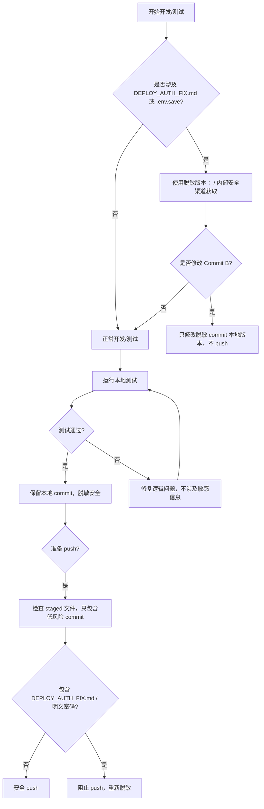

# Memory

## 2026-07-27: Data Agent + Research Agent Fusion audit frozen

- Engram curl result: `FAILED / DEFERRED` (`/profile` and `/lessons` returned HTTP 401); do not retry until the local Engram credential/service is corrected.
- Research artifact: `DATA_AGENT_RESEARCH_AGENT_FUSION_20260727.md`.
- Audit status: `ACCEPT WITH CORRECTIONS`.
- Evidence boundary: external architecture observations, third-party measurements, and Vera x JuYuan proposal are kept separate.
- Evidence Lifecycle proposal distinguishes `Expired` (time/rule driven) from `Superseded` (upstream replacement event); historical validity uses `valid_at`, not `retrieved_at`.
- Trust Gate remains an existing D23 design; no Vera architecture, runtime, production capability, or implementation claim changed.
- Buy-side Research Agent architecture gap remains open for a future evidence-recovery window.
- Audit report: `New project 5/docs/research/DATA_AGENT_RESEARCH_AGENT_FUSION_AUDIT_20260727.md`.

## 2026-07-08: Company Panorama -> Vera candidate pre-integration gate

- Engram curl result: `FAILED / DEFERRED` (`http_code=000`; local Engram API unreachable). Do not retry until Engram service is restored.
- Window intent: open a future `Company Panorama -> Vera Candidate Skill Pre-Integration Window`, not Vera Runtime integration.
- Current locked status:
  - Company Panorama: `PPT Demo Skill -> Candidate Skill` path only.
  - Vera Runtime Integration: `NOT STARTED`.
  - OpenClaw Gateway Registration: `NOT AUTHORIZED`.
  - Production Claim: `FORBIDDEN`.
- Execution order for the future window:
  1. P0 Company Identification Adapter.
     - Use `mx_ashare_finance_data` / `mx_comprehensive_finance_data` for subject resolution.
     - Output `company_name_normalized`, `stock_code`, and `entity_type`.
     - Define `company_match_confidence`.
     - Apply `company_match_filter` before notice/news records enter Trust Gate.
     - LOW or missing confidence defaults to `REJECT_BEFORE_TRUST_GATE`.
  2. P1 Real Evidence Adapter v0.
     - Replace `resolve_company()`, `fetch_announcements()`, and `fetch_news()`.
     - Only connect announcements + news.
     - Do not connect工商, litigation, or financial estimation.
  3. P2 Local Real Evidence Smoke.
     - Local samples: 宁德时代 / `300750`, one non-listed company, and one bond issuer.
     - Output a Local Real Evidence Smoke Report.
- Governance rule:
  - Announcements/news field mapping alone is not enough for real evidence integration.
  - A company name appearing in a title is not proof that the record subject is that company.
  - `company_match_confidence` is required before Trust Gate input.
  - Local Smoke must not be described as Vera PASS or Production Ready.
- Forbidden until explicitly reopened:
  - Do not connect Vera Runtime.
  - Do not register OpenClaw gateway.
  - Do not claim production readiness.
  - Do not generate a complete due-diligence card.
  - Do not describe the PPT Demo as real integration.

## 2026-07-03: Realtime Quote Integration local source gate

- Engram lesson written: `6c1c6c9ecc31`.
- Realtime Quote Integration status: `PASS WITH DEGRADATION / LOCAL SOURCE`.
- Scope: local Finance Suite source only; this is not a production capability claim.
- Implemented local source path:
  - `scripts/stock_data.py` now calls the quote gateway via `finance_data_gateway.get_finance_data("quote")` instead of relying only on an empty in-memory cache.
  - `mcp_server.py` exposes realtime `data_availability`, `allowed_use`, and `blocked_fields`.
  - `smoke_realtime_quote_integration.py` covers the local quote Trust Gate behavior.
- Local verification:
  - `compileall` passed for `scripts/stock_data.py`, `mcp_server.py`, and `smoke_realtime_quote_integration.py`.
  - `smoke_realtime_quote_integration.py`: PASS.
  - `smoke_trust_gate_runtime_v0.py`: PASS.
- Observed local quote mode:
  - `realtime.status = partial`.
  - source observed as `tushare`.
  - freshness is daily / reference data, not intraday realtime.
  - `allowed_use = [daily_reference, historical_context]`.
  - blocked fields include price / volume / amount and short-term or intraday judgement fields.
- Boundaries:
  - No deploy.
  - No push.
  - Production `/api/analyze` wrapper is not claimed integrated.
  - Realtime production ready is not claimed.
  - Intraday realtime capability is not claimed.
- Next legal window: `Realtime Quote Production Acceptance Window`.

## 2026-06-30: Engram timeline stale note

- Engram Timeline is currently `STALE` for Finance Suite status reconstruction.
- Observed gap: Engram recent lessons do not include reliable post-2026-06-24 project-state lessons, while Memory / Plans / current-session lockboards contain Day 10 / Day 11 / Day 12 window records.
- Interpretation: this is an Engram lesson-sync gap, not evidence that the project stopped progressing.
- Current factual source order for Day 11 / Day 12 status:
  1. Current-session lockboard.
  2. Project Memory.
  3. Active Plans / handoff boards, after checking for historical-status conflicts.
- Engram recent_lessons must not be used as the current SSOT for Day 11 / Day 12.
- Do not reopen or roll back already accepted windows solely because Engram lacks matching recent lessons.
- Current guardrails remain:
  - Production Ready: NOT CLAIMED.
  - Deploy Authorization: NOT GRANTED unless explicitly authorized.
  - Acceptance PASS: NOT CLAIMED unless the active acceptance window explicitly passes.

## 2026-06-25: THS Runtime Resolution closed and credential rotation P0

- Engram lesson written: `9cd2cf8aa04d`.
- Supersedes earlier 2026-06-25 THS runtime gate wording that still used `FAIL / UNKNOWN`.
- THS Theme Attribution Runtime Resolution is CLOSED.
- Final runtime verdict: `MISSING / NOT IMPLEMENTED`.
- Evidence chain:
  - Route: Missing.
  - Provider Generic: Exists.
  - Provider Specific: Missing / Not Implemented.
  - Config: Exists.
  - Therefore no THS Theme Attribution runtime object exists.
- Security state:
  - THS credential exposure containment: PASS.
  - THS credential rotation: REQUIRED.
  - Rotation status: RECORDED / NOT ROTATED.
  - Do not write raw THS credential values in chat, Memory, Engram, reports, or terminal evidence.
- Current SSOT SOP: `/Users/Zhuanz/Documents/New project 6/docs/ths_credential_rotation_sop_v0.md`.
- Contract Proof state: READY / NOT ACTIVE / BLOCKED BY P0 CREDENTIAL ROTATION.
- Legal next sequence:
  1. G rotates THS credentials in the iFinD admin surface.
  2. CC/CA updates production `.env`.
  3. Restart `finance-suite.service`.
  4. Run `ifind_data.py` reconnect smoke.
  5. Close P0.
  6. Start THS Theme Attribution Contract v0.
- Sidebar line remains separate: Phase 1 PASS WITH FINDING; transparency hotfix committed and push verified; deploy still waiting for explicit authorization.

## 2026-06-25: THS Theme Attribution runtime gate before value proof

- Engram lesson written: `ae5bc3e61f2f`.
- Rule: Provider value proof requires runtime samples; `UNKNOWN` is not `FAIL` and not low value.
- Current THS Theme Attribution status:
  - Discovery: PASS.
  - Smoke: PASS.
  - Runtime Proof: FAIL / UNKNOWN.
  - Value Proof: UNKNOWN.
  - Narrative Quality Proof: UNKNOWN.
  - Contract Proof: DESIGN READY.
  - Integration: NOT STARTED.
  - Production: UNPROVEN.
- Blocking facts:
  - Production Route: MISSING.
  - Provider: UNAVAILABLE.
  - `/api/intel/ths-theme-attribution` returns 404.
  - `/api/intel/theme-attribution` returns 404.
  - `/api/intel/ths-theme` returns 404.
- Day 7 P0: THS Theme Attribution Runtime Resolution.
- CA owns the only active line and must classify the runtime state as exactly one of:
  - `Missing`
  - `Disconnected`
  - `Implemented`
- CB is paused because Narrative Quality Proof has no `reason_type` sample.
- CC should keep Contract Proof as `READY`, not executed, because no runtime object exists yet.
- Reporting guardrail: do not call THS Theme Attribution `Provider Valuable`, `Provider Low Value`, or `Narrative Quality FAIL` until runtime samples exist.

## 2026-06-24: release gates must stay separated

- Engram lesson written: `93b46783c35c`.
- Rule: commit, push, deploy, and production smoke are separate release gates and must be reported separately.
- Sidebar partial release current state:
  - Release branch: `release/sidebar-workbench-20260623`.
  - Remote push verification: PASS.
  - Remote commit: `ede98c0`.
  - Scope: `app/market-temperature-mini.js` only; market-temperature fallback transparency.
  - Deploy: NOT AUTHORIZED.
  - Production status: NOT UPDATED by this release until a controlled deploy window runs and production smoke verifies served assets.
- Reporting guardrail: do not say production is updated just because a scoped commit or remote release branch exists.

## 2026-06-21: P1-001 RCA suspended after evidence exhaustion

- P1-001 Stock Analysis Repeatability is archived as `RCA SUSPENDED`, not `RESOLVED` and not `FAILED`.
- Final reason: evidence exhausted. Root Cause remains `UNKNOWN`; Closure remains `NOT ELIGIBLE`.
- Proven:
  - PASS path reused browser connection `connectionId=89`.
  - RETRY PASS used fresh browser connection `connectionId=235`.
  - PASS / RETRY path traverses `Browser -> 127.0.0.1:7897 (mihomo) -> upstream HTTPS`.
  - `002493` success path is repeatable.
  - Cookie serialization failure is not supported by CDP evidence.
  - HAR failed-entry Cookie absence can be an artifact.
- Still unknown:
  - FAIL attempted connection.
  - Browser layer ownership.
  - Proxy layer ownership.
  - Upstream TLS ownership.
  - Root cause.
- Canonical description: an intermittently degraded connection path occasionally hangs for about 49 seconds and fails with `ERR_SSL_PROTOCOL_ERROR`; a fresh connection immediately restores normal operation. The ownership layer of that degradation has not been proven.
- Governance lesson: `Path Participant != Fault Owner`; `Evidence Exhausted = SUSPEND`, not forced root-cause assignment.
- Reopen conditions: stable reproduction with proxy logs retained, or new telemetry such as connection tracing, proxy connection-pool metrics, or persistent debug logs.

## 2026-05-12: deep-research unknown skill production fix

- User reported the message/analyze flow broke after market intel routing changes.
- First bug was local/static frontend routing in `app/xueqiu-hot.html`: clicks went to `/app/`; minimal fix routes hot discussion to `/app/deep-research.html` and stock items to `/app/stock.html`.
- Second bug was production backend skill validation: `/home/ubuntu/finance-suite-web/static/app/deep-research.html` sends `skill_type: "deep-research"`, but `/home/ubuntu/finance-suite-web/app/skills.py` only registered `auction`, `industry`, `macro`, `mckinsey`, `meeting`, `stock`, `video`.
- Live `/api/analyze` backend is on the server in `/home/ubuntu/finance-suite-web/app/routers/api.py`, not in local `/Users/Zhuanz/finance-suite`.
- Production fix applied on 2026-05-12: added `SKILL_ALIASES` in `app/skills.py` mapping `deep-research`, `deep_research`, `deepResearch`, and `research` to existing canonical `industry`; added `normalize_skill_type()`; normalized `req.skill_type` at the start of `/api/analyze`.
- Backups on server: `app/skills.py.bak_codex_deep_alias_20260512001208` and `app/routers/api.py.bak_codex_deep_alias_20260512001208`.
- Restarted `finance-suite.service`; compile check passed; unauthenticated test now returns 401 instead of 400 unknown skill, proving skill validation is fixed.
- Detailed handoff for other agents: `docs/agent_handoff_deep_research_skill_alias_20260512.md`.

## 2026-05-12: market_intel Sidebar unblock patch

- User reported Claude got stuck while mapping `/api/analyze` and Sidebar intel routing.
- Root cause: two-repo boundary caused hesitation. `/api/analyze` lives in production `finance-suite-web`, but the local `finance-suite` repo can still prepare the MCP/server_scripts side without waiting for ECS entrypoint inspection.
- Applied local unblock patch in `/Users/Zhuanz/finance-suite`:
  - `scripts/market_intel.py`: `hot_stocks()` fallback chain now includes `zt_pool` after `hot_rank/top_gainers/hot_up`.
  - `server_scripts/intel_api.py`: added direct dict routes for `/api/intel/discussions`, `/api/intel/hot-stocks`, `/api/intel/watch-alerts`, `/api/intel/research`, `/api/intel/all`.
  - `mcp_server.py`: added MCP tools `research_digest(...)` and `market_intel(...)`, both wrapping outputs with `_wrap_response`.
  - `requirements.txt`: added `fastapi` and `flask` because `server_scripts/intel_api.py` / `watchlist_api.py` already depend on them; local `.venv` had been missing FastAPI.
- Validation:
  - `py_compile` passed for `server_scripts/intel_api.py`, `mcp_server.py`, `scripts/market_intel.py`, `scripts/research_digest.py`, `scripts/digest_llm.py`.
  - `pytest tests/test_digest_llm.py tests/test_research_digest.py -q` => core research suite `14 passed`.
  - Direct MCP calls passed: `mcp_server.research_digest(action="latest", limit=1, max_llm=0)` and `mcp_server.market_intel(modules="research", limit=1)`.
  - Direct route function calls passed for `intel_research(limit=1, max_llm=0)` and `intel_all(limit=1, modules="research")`.
- Updated agent handoff doc: `docs/market_intel_sidebar_handoff_20260512.md`.

## 2026-05-12: research Sidebar local E2E demo

- Claude correctly identified a "completion illusion": schema/tests/tools were green, but nobody had seen a real dehydrated research card in the browser.
- Built a local E2E demo that bypasses production `finance-suite-web`:
  - `scripts/research_demo_api.py`: minimal FastAPI app serving `app/index.html` and exposing `/api/intel/research` via direct `research_digest.latest(...)`.
  - `app/index.html`: added fourth tab `脱水研报`, `pane-research`, `fetchResearch()`, `renderResearch()`, and `routeResearch()`.
  - Localhost auth bypass: `app/index.html` skips the `fs_auth` redirect only on `localhost` / `127.0.0.1`; production domains still require login.
  - `requirements.txt`: added `uvicorn`.
- Validation:
  - Demo server runs with `.venv/bin/uvicorn scripts.research_demo_api:app --host 127.0.0.1 --port 8765`.
  - `curl http://127.0.0.1:8765/api/intel/research?limit=2&max_llm=1` returned real Eastmoney research items.
  - First observed item: `中国综合能源装备制造龙头，燃机&新能源构筑第二增长曲线`.
  - Without LLM key, `digest_status=fallback`; this proves the product loop is alive but the differentiation still depends on `OPENROUTER_API_KEY` or `ANTHROPIC_API_KEY`.
  - `py_compile` passed and `pytest tests/test_digest_llm.py tests/test_research_digest.py -q` => core research suite `14 passed`.
- Handoff doc updated: `docs/market_intel_sidebar_handoff_20260512.md`.

## 2026-05-12: ECS intel research route fact check

- Ran read-only SSH checks against `ubuntu@touziagent.com`.
- Production FastAPI entrypoint is `/home/ubuntu/finance-suite-web/app/main.py`; it includes `pages`, `api`, `admin`, `intel`, and `watchlist` routers.
- systemd service is `finance-suite.service`: `uvicorn app.main:app --host 127.0.0.1 --port 8000 --workers 4`.
- nginx `/api/` proxies to `127.0.0.1:8000`; `/app/` serves `/home/ubuntu/finance-suite-web/static`.
- Production `/home/ubuntu/finance-suite-web/app/routers/intel.py` has `/api/intel/research`, but it is a compatibility stub returning HTTP 200 with `_qc.status=failure` and error `research route is not connected to a live upstream yet`.
- Production `static/app/index.html` does not contain `脱水研报`, `fetchResearch`, or `pane-research`, so the 4-tab research UI is not deployed.
- Conclusion: production `/api/intel/research` being 200 does not mean live `research_digest` is deployed. It is a safe placeholder. Docs updated: `docs/backend_api_architecture_20260512.md` and `docs/production_stability_guard_20260512.md`.

## 2026-05-12: production stability guard before next release

- User asked Codex to finish after Claude hit daily limit, with the priority: keep tomorrow's website basic functions online.
- Decision: freeze feature expansion. Do not deploy local research Sidebar demo or connect live research routes until deployment window; ECS §九 has since confirmed production router/static facts.
- Production observations from unauthenticated smoke checks:
  - `https://www.touziagent.com/app/index.html` => 200
  - `https://www.touziagent.com/app/stock.html` => 200
  - `https://www.touziagent.com/app/deep-research.html` => 200
  - `POST /api/analyze` without login => 401, healthy guard behavior
  - Initial `GET /api/intel/research?limit=1` was 404; later ECS confirmation found it now returns HTTP 200 from a compatibility stub with `_qc.status=failure` and `research route is not connected to a live upstream yet`.
- Added `scripts/site_smoke_check.py`: conservative production smoke check requiring no credentials. It treats static app pages and unauthenticated `/api/analyze` guard as critical, and treats `/api/intel/research` as optional but validates that any 200 remains the known `_qc.status=failure` stub until live deployment.
- Added `docs/production_stability_guard_20260512.md`: tomorrow morning checklist, hard freeze rules, and failure triage.
- 2026-05-13 verifier update: full pytest discovery currently returns `16 passed`; the original research-focused pair remains `14 passed`.
- Long-term guard rule: never accept HTTP 200 alone as proof of launch. Verify response body, `_qc.status`, production path, router source, production static drift, and update the fact-source docs for any status change.
- Reminder: quote URLs containing `?` in zsh, e.g. `curl -i 'https://www.touziagent.com/api/intel/research?limit=1'`.

## 2026-05-12: production watchlist 404 follow-up

- Production logs showed repeated `GET /api/watchlist/list` 404s after the deep-research fix.
- Cause: production `finance-suite-web/static/app/index.html` polls `/api/watchlist/list`, and `stock.html` posts `/api/watchlist/add`, but FastAPI had no watchlist router registered. Local `server_scripts/watchlist_api.py` is Flask Blueprint style and was not mounted.
- Production fix applied: created `/home/ubuntu/finance-suite-web/app/routers/watchlist.py`, registered it in `/home/ubuntu/finance-suite-web/app/main.py`, and also mounted existing `intel.router` which existed but was not included.
- Watchlist router uses existing `/home/ubuntu/finance-suite/scripts/watchlist.py` and `~/.finance-suite/watchlist.json`.
- Verified `GET /api/watchlist/list -> 200 OK` with empty success payload; `POST /api/watchlist/add {}` returns expected 400 `query 不能为空`.
- While mounting intel, `/api/intel/xueqiu-hot-stock` exposed an AkShare upstream parse failure. Adjusted intel exception contract to HTTP 200 + `_qc.status=failure` + empty `data`, so frontend fallback works without 5xx log noise.
- Additional backups on server: `app/main.py.bak_codex_watchlist_20260512011010`, `app/routers/intel.py.bak_codex_status_contract_20260512011113`.

## 2026-05-12: canonical deep-research frontend and intel helper

- Chose to do A+B from the follow-up list.
- Production `/home/ubuntu/finance-suite-web/static/app/deep-research.html` now sends canonical `skill_type: "industry"` instead of legacy `deep-research`.
- Local source `/Users/Zhuanz/finance-suite/app/deep-research.html` now sends canonical `skill_type: "industry"` instead of `deep_research`, so future deploys should not reintroduce legacy aliases.
- Alias layer remains in production backend for backward compatibility.
- Production `app/routers/intel.py` now documents the intel contract and uses `_intel_failure(error)` helper for HTTP 200 + `_qc.status=failure` + empty `data`.
- Verified production `GET /api/intel/xueqiu-hot-stock -> 200 OK` with `_qc.failure` and `GET /api/watchlist/list -> 200 OK`.
- Additional backups on server: `static/app/deep-research.html.bak_codex_canonical_skill_20260512012127`, `app/routers/intel.py.bak_codex_failure_helper_20260512012127`.

## 2026-05-12: final production stabilization before handoff

- Goal: make sure core website functions will not drop tomorrow.
- Added production `GET /api/check-auth` in `/home/ubuntu/finance-suite-web/app/routers/api.py`; logged-out requests now return expected 401 instead of 404, and authenticated admin-token check returns 200 with `{authenticated, username, tier}`.
- Added production intel compatibility routes in `/home/ubuntu/finance-suite-web/app/routers/intel.py`: `/api/intel/discussions`, `/api/intel/hot-stocks`, `/api/intel/watch-alerts`, `/api/intel/research`, `/api/intel/all`.
- Unconnected intel modules use the `_intel_failure` contract: HTTP 200 + `_qc.status=failure` + empty payload.
- Added local deprecation warning to `/Users/Zhuanz/finance-suite/server_scripts/watchlist_api.py`: old Flask watchlist API is not mounted in production; production uses `finance-suite-web/app/routers/watchlist.py`.
- Final public smoke passed: `/`, `/app/index.html`, `/app/deep-research.html`, `/app/stock.html`, `/api/health`, `/api/watchlist/list`, `/api/intel/xueqiu-hot`, `/api/intel/xueqiu-hot-stock`, `/api/intel/research`, `/api/intel/all` all return 200; `/api/check-auth` returns expected 401 when logged out.
- Additional production backups: `app/routers/api.py.bak_codex_check_auth_20260512020447`, `app/routers/intel.py.bak_codex_intel_stubs_20260512020548`.

## 2026-05-16: Finance Suite security TODO and local development rules

### Low-priority security risk: `DEPLOY_AUTH_FIX.md` plaintext passwords

- Risk file: `DEPLOY_AUTH_FIX.md`.
- Historical plaintext passwords exist in GitHub public `origin/main` history:
  - `linzuxi / <REDACTED>`
  - `shengwei / <REDACTED>`
  - `demo / <REDACTED>`
  - `zhuanz / <REDACTED>`
  - `hfzq / <REDACTED>`
- Current local status:
  - A local redacted version is prepared, using `<PASSWORD>` or `请通过运维安全渠道获取`.
  - Not pushed to remote.
  - Repository access/traffic is low, so short-term risk is currently controlled.

Short-term strategy:

1. Do not push redacted Commit B or any `DEPLOY_AUTH_FIX.md` related commit until the history question is resolved.
2. Keep the repository private or access-restricted.
3. Make sure team members know the risk and do not share sensitive commits.

Long-term strategy:

1. Rotate production server account passwords.
2. Clean git history to remove old plaintext passwords from `DEPLOY_AUTH_FIX.md` with `git filter-repo`.
3. Move sensitive deployment docs to `docs/internal/`.
4. Use only `<PASSWORD>` / internal secure-channel placeholders for passwords in commits and docs.

### Local development rules

1. `DEPLOY_AUTH_FIX.md`
   - Use only `<PASSWORD>` or `请通过运维安全渠道获取`.
   - Use placeholders in curl examples and command examples.
2. Test accounts
   - `demo` account may be used for local testing; password must be obtained via operations channel.
   - Production account passwords should exist only in the server database or internal operations docs.
3. `.env` files
   - `.env.save` is permanently ignored.
   - `.env.example` should contain only empty placeholders.
4. Commit / push
   - Never commit plaintext passwords.
   - Push the redacted Commit B only after history cleaning is complete.
   - Other feature work can be committed normally, but avoid sensitive examples.
5. Repository access
   - Do not push redacted Commit B or historical plaintext commits to a public repository.
   - Low-risk commits such as `monitor_sources.py`, `requirements.txt`, and `MEMORY.md` may be committed normally.

### Current C / CC action guide

C / Claude:

1. Pause Commit B and any other commit containing `DEPLOY_AUTH_FIX.md`.
2. Continue local development and testing under the local development rules above.
3. Wait for history-cleaning instructions or security-owner approval before submitting redacted Commit B.

CC / Codex:

1. Gatekeep: confirm team members do not push historical leaked commits.
2. Track the low-priority security TODO until it is resolved.
3. Review history cleaning and the redacted Commit B before giving final PASS / BLOCK.

### Local development security flow

## 2026-05-15: production password rotation record

### Operation overview

- Operator: Codex via SSH to `ubuntu@touziagent.com`.
- Operation time (UTC): `2026-05-15T17:27:02Z`.
- Scope: Rotate passwords for leaked production accounts.
- Safety note: All new passwords were generated and applied on the remote server. No plaintext passwords were printed or stored locally.

### Rotated accounts

| Username | Tier | Status | Note |
|---|---|---|---|
| linzuxi | vip | rotated | Password updated; bcrypt hash stored |
| shengwei | vip | rotated | Password updated; bcrypt hash stored |
| demo | vip | rotated | Password updated; bcrypt hash stored |
| zhuanz | vip | rotated | Password updated; bcrypt hash stored |
| hfzq | vip | rotated | Password updated; bcrypt hash stored |

### Database backup

- Path: `/home/ubuntu/finance-suite-web/finance_suite.db.bak_rotate_20260515T172702Z`.
- Permission: `0600`.
- Purpose: Rollback and audit only; does not contain plaintext passwords.

### Remote handoff

- Path: `/home/ubuntu/.finance-suite/rotated_passwords_20260515T172702Z.json`.
- Permission: `0600`.
- Note: Stored only on the production server for operations handoff. Do not copy into git or local workspace.

### Verification

- `https://www.touziagent.com/api/login` demo login check: HTTP `200`.
- `https://touziagent.com/api/login` apex-domain check: HTTP `405` because the canonical login endpoint is on `www`.

### CC review

- Reviewer: Codex.
- Review time (UTC): `2026-05-15T17:27:02Z`.
- Review note: Rotation followed the safety rule: no plaintext passwords were recorded locally.

## Finance Suite: production password rotation / history-cleaning / local validation tracking template

| Operation ID | Operation type | Repository / mirror path | HEAD / Commit | Time (UTC) | Operator | `DEPLOY_AUTH_FIX.md` sensitive history status | Local enhanced validation report path | Notes |
|---|---|---|---|---|---|---|---|---|
| 1 | Local mirror dry run | `/tmp/finance-suite-filter-repo-dryrun-20260516012815.git` | `2e7cdb5` | `2026-05-16T01:28:15Z` | Codex | CLEAN | N/A | No force push; isolated dry run |
| 2 | Formal history clean | `/Users/Zhuanz/finance-suite` or safe clone | TBD | TBD | Zhuanz | TBD | N/A | Execute only after approval; force push requires separate approval |
| 3 | Production password rotation | Remote `/home/ubuntu/finance-suite-web` | N/A | `2026-05-15T17:27:02Z` | Codex | N/A | N/A | Passwords generated remotely; handoff file `0600`; `MEMORY.md` records no plaintext passwords |
| 4 | Historical safety verification | Same as operation #2 mirror / repository | TBD | TBD | Zhuanz | CLEAN | N/A | Verify with grep after cleaning |
| 5 | Re-submit redacted Commit B | `/Users/Zhuanz/finance-suite` | TBD | TBD | Zhuanz | CLEAN | `logs/mcp_local_test_YYYYMMDDTHHMMSSffffff+0000.md` / `logs/mcp_local_test_YYYYMMDDTHHMMSSffffff+0000.html` | Strict staged-file check; no plaintext passwords |

Usage notes:

1. Operation ID: record actions in sequence.
2. Operation type examples: local mirror dry run, formal history clean, production password rotation, historical safety verification, re-submit redacted Commit B.
3. Time / operator: use UTC and the actual executor.
4. Sensitive-value status: use `CLEAN`, `FOUND`, or `TBD`.
5. Local enhanced validation report path: record generated Markdown / HTML report paths so the team can inspect MCP Server tool success rate, fallback levels, and errors.
6. Notes: record special precautions, backup paths, or manual rollback notes without plaintext passwords.
7. Safety rules:
   - Do not record plaintext passwords in `MEMORY.md` or local files.
   - Keep handoff files and backups remote-only with `0600` permissions.
   - Execute force push only after explicit security approval.
8. Append a new row for each future dry run, rotation, verification, local validation, or clean.

## High-risk account expansion rule

- Scope: A second production password rotation would cover the remaining admin account plus six VIP accounts.
- Requirement: Do not execute any rotation for these accounts without explicit authorization.
- Purpose: Prevent accidental high-privilege account changes and avoid production security incidents.
- Before execution: Obtain approval from the security owner or an authorized approver.
- Note: This rule runs alongside the existing low-risk local development rules, redaction rules, and Memory execution constraints. It does not replace the `git filter-repo` command plan.

## 2026-05-28: Research Runtime v0.2 accepted

- `research_runtime/` package complete: `session.py`, `events.py`, `workflow.py`, `__init__.py`.
- Both smoke tests pass: `smoke_research_runtime.py` (local mode) and `smoke_research_runtime_gateway.py` (gateway mode).
- `compileall` clean on all new modules.
- Artifacts confirmed: `/tmp/research_runtime_latest.json`, `/tmp/research_runtime_events.jsonl` (11 events).
- Gateway online path: `finance_data_gateway.get_finance_data("quote", symbol)` via Wind → Tushare → JoinQuant → AkShare → cache.
- Gateway offline fallback: `local_research_stub` — no network, no LLM.
- Acceptance doc: `docs/research_runtime_v0_2_acceptance.md`.
- Not included: production router, frontend UI, new data_type, new provider, LLM calls.
- Next phase: v0.3 — not started, scope TBD.

## 2026-06-19: deep-research PDF Button hotfix ready, deploy blocked

- Status board:
  - Code Readiness: READY.
  - Local Validation: PASS.
  - Deployment Channel: BLOCKED.
  - Production Status: NOT FIXED YET.
  - Classification: Blocked by Infrastructure.
- Local patch: `/Users/Zhuanz/finance-suite/app/deep-research.html`.
- Local SHA-256: `688dcfe055d64157704bcb4177d25e2fd093a7d7dc25c6a66aeb18c7e83ab3f9`.
- Local size: `16428` bytes.
- Production SHA-256 observed from `https://www.touziagent.com/app/deep-research.html`: `a076d06472fde0591f52455ea73ed6ba5be4f6f9cd3bf5fb324f568be3682e3a`.
- Production size: `12216` bytes.
- Local adds PDF frontend loop to `deep-research.html`: `pdfActionBar`, `exportPdfBtn`, `exportPdfBtnText`, `currentReportHtml`, `exportToPdf()`, `POST /api/export-pdf`, and `导出PDF` button text.
- Production still lacks the PDF markers above, so the fix is not deployed.
- Unique deploy target: `/home/ubuntu/finance-suite-web/static/app/deep-research.html`.
- Unique source file: `/Users/Zhuanz/finance-suite/app/deep-research.html`.
- Accepted deployment paths:
  - Restore SSH permission for `ubuntu@119.28.156.125`.
  - Use Tencent Cloud browser terminal.
  - Ask an authorized operator to upload the single file.
- Do not continue code changes for this issue until a deployment channel is available. Other pages remain P2 and are out of scope.

## 2026-06-21: Mac Wind Alice Desktop Provider Harness frozen

- State: `FROZEN`.
- Current verdict: `Lab Verified / Production Unproven`.
- Governance: `7-Gate Locked`; no skip-level promotion.
- Provider metadata for future Finance Suite wiring:
  - `provider_tier = desktop`
  - `provider_mode = real`
  - `provider_class = wind_alice_harness`
- Name discipline: call it `Lab Verified Desktop Harness`, not `Production Wind Provider`.
- New-Mac migration entry point: start from `./wind_focus geom`, then follow the 7-Gate chain in `scripts/alice_poc/MIGRATION.md`.
- Gate discipline: `Geom PASS != Provider PASS`; Gate 4 is the first proof of `Prompt -> Alice -> Capture -> Structured Output`; Gate 7 is required before `Candidate Real Provider`.
- Failure attribution: route Wind/Alice UI, macOS permission, focus, sleep, or desktop automation failures to `Desktop Harness Layer`, not Research Runtime, Trust Gate, or Data Gateway.
- Local evidence chain remains local-only and ignored by git: `scripts/alice_poc/data/01.json`, `03.json`, `04.json`, `05.json`, and `capture_verify.json`.
- Commit state recorded by CC: `5b0fda3` capture harness, `78cba49` migration guide; branch `feature/session-1-validation-outcomes`, ahead and not pushed.

## 2026-06-25: 信源评估三证模板 (THS Theme Attribution 跑通)

- 状态: 三证未齐,Integration / Deploy / Production 全部维持冻结。
- 决策顺序(强制):
  `Runtime Proof (CA)` + `Value Proof (CB)` → `Integration Authorization Review` → `Implementation / Integration` → `Contract Requirements Closure` → `Deploy Review` → `Production Evaluation`。
- 可复用信源模板(所有新数据源/Agent Skill 通用):
  `Candidate Discovery` → `Smoke` → `Runtime Proof` → `Value Proof` → `Contract Proof` → `Integration Authorization` → `Deploy` → `Production`。
- 关键反模式(明确禁止):
  - `Discovery PASS + Smoke PASS` ≠ 任何后续状态升级依据。
  - "代码里没实现" → "功能失败" → "项目失败" 是跳跃式降级,实际只能得到"已审计路径未发现实现"(证据结论,不是产品结论)。
  - `Contract Findings Logged` ≠ `Contract Proof Completed`,前者只是识别未来契约条件。
- 适用场景示例: THS Theme Attribution / mootdx 五档盘口 / 巨潮公告 / Wind Alice Provider / 未来新 Agent Skill。
- Engram 教训 ID: `ce949d1fe279`(domain=finance-suite,retention=long_term)。

## 2026-06-29: Analyze Trust Presentation Windows final locked state

- Final state:
  - Window 1 Reality -> Presentation: `CLOSED / ACCEPTED WITH FINDINGS`.
  - Window 2 Presentation -> Acceptance: `CLOSED / ACCEPTED WITH FINDINGS`.
  - Production Ready: `NOT CLAIMED`.
  - Deploy Authorization: `NOT GRANTED`.
  - Acceptance PASS: `NOT CLAIMED`.
  - Runtime Full Recovered: `NOT CLAIMED`.
  - Window 3 Decision -> Production Drill: `NOT STARTED / WAITING`.
- Evidence already established:
  - Three authenticated cases produced raw Trust Data and rendered Trust Presentation:
    - `600519.SH` 贵州茅台.
    - `600036.SH` 招商银行.
    - `600710.SH` 苏美达.
  - Raw `/api/analyze` response includes `data_availability`, `_qc.data_availability`, `section_data_usage`, and `_qc.section_data_usage`.
  - Rendered pages show `可信度说明` and `数据完整性摘要`.
  - Visible raw leak check found no `nan/null/None/N/A` leak in the checked render outputs.
- Findings remain as risk records and do not trigger automatic remediation:
  1. `section_data_usage` is still a minimum explicit structure (`{}`); section-level evidence display is not yet mature.
  2. `cached=true` trust fields are protected by return-time wrapper; do not claim old cache entries were originally complete.
  3. `600710.SH` current name is `苏美达`; `常林股份` is historical name. Resolver / source coverage risk remains.
  4. `600036 / 600710` have data quality weakness, action-like wording risk, and incomplete full-body evidence tracing.
  5. Production Ready is outside Window 2 proof scope.
- Governance rule:
  - Do not automatically enter Window 3.
  - Do not fix findings unless a separate remediation window is explicitly opened.
  - Do not expand Framework, authorize deploy, or promote Production Ready from Window 1/2 results.
- Engram lesson written:
  - `38fd53011f42` — conclusion must not exceed its directly supported evidence layer.

## 2026-06-30: Presentation local patch and live target proof lock

- Final accepted state:
  - Presentation Truth Guard: `LOCAL PATCH REPORTED / LIVE TARGET UNVERIFIED`.
  - Data Transparency Collapse: `PASS / LOCAL SOURCE`.
  - Live Target Proof: `NOT ESTABLISHED`.
  - Live Presentation: `NOT ESTABLISHED`.
  - Reality -> Presentation Window: `HOLD / FAIL`.
  - Raw Source Mapping 6 Items: `LOCKED / UNKNOWN`.
  - Live Page: `NOT UPDATED with local guard/collapse patch`.
  - Production Ready: `NOT CLAIMED`.
  - Window 1: `CLOSED / ACCEPTED WITH FINDINGS`.
  - Presentation Guard Patch: `NOT UPGRADED TO LIVE PROOF`.
  - Window 2: `CLOSED / ACCEPTED WITH FINDINGS / ARCHIVED`.
  - Window 3: `NOT STARTED / REQUIRES EXPLICIT AUTHORIZATION`.
- Docs Archive Maintenance: `PASS`.
- Local UX Patch: `DONE`.
- Next explicit entry points only:
  1. Deploy local `app/*.html` to production `static/app/`.
  2. Fix SSH path and read server target files first.
- Recommended next entry: fix SSH / read server target files first, because live HTTP already proves production pages are not updated and direct deploy could carry uncommitted local HTML plus earlier `/api/analyze` changes.
- Boundary:
  - Do not modify `/api/analyze`, Auth, backend, contract, or deploy without explicit authorization.
  - Do not continue `Plans.md` edits, CC status writing, or small UX follow-ups from this closed window.
- Engram curl result:
  - Attempted `POST /lessons` on local Engram API with `X-API-Token`.
  - Engram rejected storing the status snapshot as a long-term lesson: `World State or Runtime State should not be stored as long-term Engram memory.`
  - No Engram lesson ID was created for this state snapshot; the durable project record is this `MEMORY.md` entry.

## 2026-07-03: Report UX Folding Patch local-source lock

- Final accepted state:
  - Report UX Folding Patch: `PASS / LOCAL SOURCE`.
  - Transparency: `PRESERVED`.
  - Data Chain: `UNCHANGED`.
  - Production Ready: `NOT CLAIMED`.
  - Push: `NOT AUTHORIZED` before this commit request.
  - Deploy: `NOT AUTHORIZED`.
- What changed locally:
  - `app/stock.html` now renders report body before trust/transparency details.
  - `数据完整性摘要`, `信源检索情况`, and `QC / Trust Gate 详情` are split into default-collapsed `
` sections.
  - Disclosure titles retain status cues such as Partial, available source keys, blocked fields, allowed use, and `_qc.status`.
- Boundary preserved:
  - No provider, prompt, backend contract, or `/api/analyze` data-chain change.
  - Do not turn unavailable data into available data.
  - Body compliance filtering remains responsible for blocking current-price, capital-flow, valuation, short-term breakout, position, and unsupported trend claims when `realtime`, `capital_flow`, `valuation`, or `macro` data is unavailable.
- Deployment rule:
  - Do not upgrade this local-source PASS to production PASS.
  - Only legal next entry is `Report UX Folding Deploy Window`.
  - Deploy window requires git diff review, selective `stock.html` commit/review, production target mapping, backup + checksum, smoke proof, and rollback path.
- Engram lesson written:
  - `d707e07f43f7` — Report UX folding must preserve transparency and trust boundaries; local-source UX PASS is not live or production proof.

## 2026-07-18: Valuation snapshot truthfulness review

- Reviewed commit `7eddfc9` and the deployed valuation-table claims.
- 2026-07-17 was a broad market selloff; valuation colors represent relative valuation, not daily price direction.
- `app/market-valuation-snapshot.js` is a hard-coded single-day snapshot. No runtime provider request, persistent refresh job, raw response, or field-mapping evidence is present.
- Truthful status: `STATIC SNAPSHOT / SOURCE ATTRIBUTED / AUTOMATION NOT ESTABLISHED`.
- PE-derived earnings yields were arithmetically correct. PE/PB/ROE values lacked a committed raw-provider evidence bundle, so independent provenance remains incomplete.
- The implementation has no historical percentile series or star-rating rules and must not be described as a complete replication of the Bank Luosiding method.
- A `session-only cron` is not production scheduling and must not be represented as durable weekly automation.
- Handoff to Claude Code is recorded in `docs/sync-to-c-valuation-automation-20260717.md` under `Codex 复核同步（2026-07-18）`.

## 2026-07-21: Vera V4 roadshow visual and narrative closure

- Runtime truth source: `roadshow-2026-06/html/index.html`; design drafts are not integration evidence.
- Audience-language rule: Chinese explains the value first; English remains only where it identifies a necessary capability or product term.
- Trust framing: the Trust Gate page presents compliance, evidence grading, and answer boundaries as the reason institutions can trust Vera, rather than as an internal engineering mechanism.
- Visual verification rule: slide completion requires checking the actual rendered 16:9 viewport, including text legibility, overflow, image loading, and first-frame initialization.
- Evidence boundary preserved: no invented market, revenue, customer, or production claims were added for presentation completeness.
- Engram lesson written: `b51126ea8465`.
