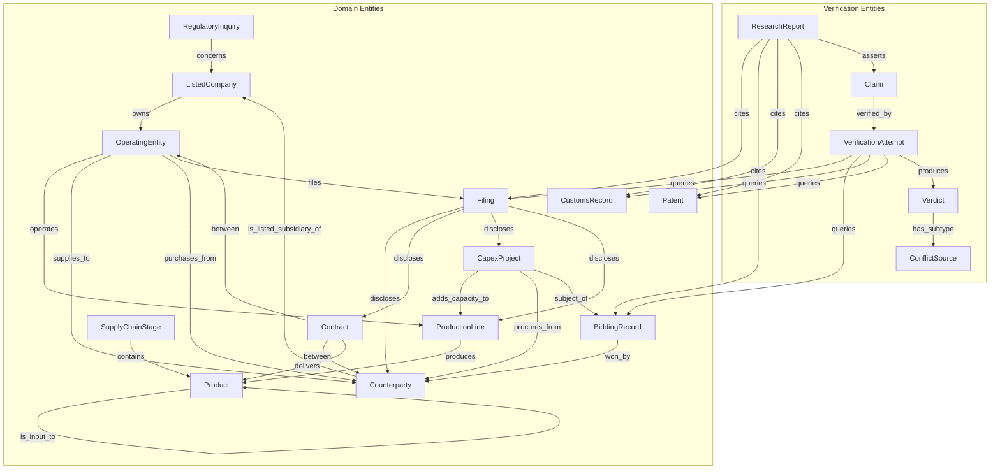

# L0 Verification Ontology — v0 Draft

> **Status:** DRAFT for Session 1 bootstrap. NOT a contract.
> **Owner:** TBD (建议: 3 个 case owner 各认领一类)
> **Created:** 2026-06-08
> **Purpose:** 给 P0a.5 Supply Chain Consistency Model 提供统一的概念词汇
> **Relationship:** L0 之上是 P0a.5 (a/b/c)，再之上是 P0b/c/d 契约。本文档**不规定**字段类型、必填约束、verifier 行为。

---

## 0. 一句话定位

L0 是 "verification 的 schema 的 schema"——它定义**我们在验证产业链一致性时会用到哪些 entity / relation / property / invariant**。它不规定这些 entity 怎么抽取、怎么存、怎么 query，那些是 P0b (Extraction Schema) 的事。

如果 P0a.5a "Definition of Consistency" 是剧本，L0 是剧本里出现的角色清单。

---

## 1. 范围内 / 范围外

### 1.1 范围内

- 产业链一致性验证所需的核心 entity（公司、产线、产品、合同等）
- entity 之间的 trade / ownership / project / evidence 关系
- 用于 matching 的关键 property（数值、比例、增长率、容量）
- 5 类一致性 invariant（mirror / capacity chain / cash-logistics / temporal / transitivity）
- 验证流程中的 metadata entity（Claim / VerificationAttempt / Verdict）

### 1.2 范围外（P0a.5b.a — 永远无法验证，**禁止尝试**）

- 管理层能力 / 组织效率 / 研发文化 / 战略执行力
- 未来技术路线 / 卡点地位的"长期性"判断
- 行业景气度 / 周期阶段 / 估值合理性
- 任何"靠 LLM 感觉"的非数据判断

### 1.3 范围外（P0a.5b.b — 数据源覆盖不到，标 deferred）

- 海外非中港台上市公司的内部运营数据
- 非上市公司（无公开披露义务）的产能/订单/客户数据
- 商业秘密级别的客户清单

### 1.4 范围外（P0a.5b.c — cost-bound，user opt-in 才跑）

- 海关逐单数据（vs 聚合 HS code 数据）
- 招投标全量历史
- 工商变更记录全量抓取

---

## 2. Entity 类型

### 2.1 核心 domain entities（"产业链里有什么"）

#### 2.1.1 `ListedCompany` 上市公司

- **定义**：在交易所上市、有定期披露义务的法人主体
- **存在理由**：是 verification 链的锚点，code 是稳定的 identifier
- **核心 props**：`code` (e.g., `600519.SH`), `name`, `exchange`, `industry_code`
- **3-case 覆盖**：
  - 光伏：✓ (通威/隆基/中环)
  - 半导体设备：✓ (北方华创/中微/拓荆)
  - 苹果链：✓ (立讯/蓝思/歌尔)

#### 2.1.2 `OperatingEntity` 经营主体

- **定义**：实际开展业务、签合同、披露客户/供应商的法人单元
- **存在理由**：**重要** — 上市公司是壳，产能和客户挂在子公司、孙公司上。**ListedCompany ≠ OperatingEntity** 必须显式分开
- **核心 props**：`legal_name`, `parent_listed_code`, `unified_social_credit_code`, `ownership_pct`, `business_scope`
- **3-case 覆盖**：
  - 光伏：✓ (通威股份 vs 通威太阳能)
  - 半导体设备：△ (大多 ListedCompany 自己运营)
  - 苹果链：✓ (立讯有多家子公司做不同产品)

#### 2.1.3 `Product` 产品/品类

- **定义**：被生产 / 销售 / 采购的物项
- **存在理由**：产业链的核心是 "什么东西在谁手里"
- **粒度问题**（**TBD — Session 1 必须定**）：
  - Option A: SKU-level (硅料-多晶硅-致密料)
  - Option B: category-level (硅料/硅片/电池片/组件)
  - Option C: 自定义层级 (category + spec tuple)
- **核心 props**：`product_code`, `product_name`, `category`, `spec`, `unit`
- **3-case 覆盖**：
  - 光伏：✓ (硅料/硅片/电池片/组件)
  - 半导体设备：✓ (刻蚀机/PVD/CVD/清洗机)
  - 苹果链：✓ (连接器/声学/组装/玻璃)

#### 2.1.4 `ProductionLine` 产线/工厂

- **定义**：具有明确产能、地理位置的物理生产单元
- **存在理由**：**"产能扩张" 故事是关于产线，不是关于公司**。A 公司整体产能翻倍，可能是新建 3 条产线 + 旧产线关停
- **核心 props**：`line_id`, `location`, `capacity_value`, `capacity_unit`, `status` (planned/under_construction/operational/decommissioned)
- **3-case 覆盖**：
  - 光伏：✓✓ (核心 entity，典型 CAPEX 故事)
  - 半导体设备：△ (产能口径不同，按 wafer 产能 vs 按设备台数)
  - 苹果链：✗ (组装产能通常是 "工厂面积" 而非 "产线数")

#### 2.1.5 `SupplyChainStage` 产业链环节

- **定义**：upstream / midstream / downstream 的层级抽象
- **存在理由**：产业链故事常涉及 stage 间关系，不显式建模 stage 容易把"上游卖给谁"和"下游卖给谁"混在一起
- **核心 props**：`stage_id`, `position` (upstream/midstream/downstream), `description`
- **3-case 覆盖**：
  - 光伏：✓ (硅料-硅片-电池-组件-电站)
  - 半导体设备：△ (设备厂上游是零部件，下游是 fab，stage 划分需重新设计)
  - 苹果链：✓ (零部件-模组-ODM-品牌)

#### 2.1.6 `Counterparty` 交易对手

- **定义**：supplier / customer / 关联方 / 潜在合作方
- **存在理由**：年报披露前五大客户/供应商，但客户身份常被匿名 ("客户 A")。Identifier 不一定稳定
- **核心 props**：`name`, `is_listed` (bool), `listed_code` (nullable), `country`, `counterpart_type` (listed/unlisted/government/overseas/related_party)
- **3-case 覆盖**：
  - 光伏：✓ (中环/隆基作为 client 公开)
  - 半导体设备：✓ (中芯国际/华虹公开)
  - 苹果链：✓✓ (Apple 公开)

#### 2.1.7 `Contract` 合同/订单

- **定义**：双方签订、有金额/数量/交付期的商业承诺
- **存在理由**："订单爆发" 故事的载体。重要披露义务触发点是"重大合同" (主板 ≥ 3 亿、创业板 ≥ 1 亿)
- **核心 props**：`contract_id`, `amount`, `currency`, `sign_date`, `delivery_period_start/end`, `scope`, `is_material` (bool)
- **3-case 覆盖**：
  - 光伏：△ (组件订单常通过框架协议)
  - 半导体设备：✓✓ (设备厂以订单为收入确认单位)
  - 苹果链：✓ (Apple 订单通过 Apple Inc. 财报侧验证)

#### 2.1.8 `CapexProject` 资本开支项目

- **定义**：具体的扩产 / 改建 / 新建项目
- **存在理由**：产能扩张故事的**最直接证据**。`在建工程` + `capex` + `环评/能评/备案` 是验证三角
- **核心 props**：`project_id`, `name`, `total_budget`, `start_date`, `planned_completion`, `actual_completion`, `status`, `approvals` (环评号/能评号/备案号)
- **3-case 覆盖**：
  - 光伏：✓✓ (核心 entity)
  - 半导体设备：✓ (设备厂扩产也有 capex)
  - 苹果链：✗ (苹果链公司通常不靠 capex 扩张)

#### 2.1.9 `BiddingRecord` 招投标记录

- **定义**：公开招投标系统的中标 / 招标记录
- **存在理由**：政府采购 / 国企招标的硬证据。半导体设备厂的核心客户 (中芯/华虹) 多为国企或政府项目
- **核心 props**：`tender_id`, `tender_name`, `winner_name`, `winner_listed_code` (nullable), `amount`, `announce_date`, `equipment_or_service`
- **数据源**：中国招标投标公共服务平台、各地公共资源交易中心
- **3-case 覆盖**：
  - 光伏：△ (光伏组件招标有，但金额口径易混淆)
  - 半导体设备：✓✓ (核心 entity)
  - 苹果链：✗ (Apple 不招标)

#### 2.1.10 `CustomsRecord` 海关记录

- **定义**：进出口报关数据
- **存在理由**：跨境 trade 的硬证据。上游材料/设备进口、中游产品出口的可验证
- **核心 props**：`hs_code`, `product_desc`, `volume`, `value_usd`, `direction` (import/export), `date`, `party_name`
- **3-case 覆盖**：
  - 光伏：✓ (组件出口、硅料进口)
  - 半导体设备：✓ (设备出口、零部件进口)
  - 苹果链：✓ (连接器/模组进出口)

#### 2.1.11 `Patent` 专利/认证

- **定义**：与核心技术相关的专利、商标、认证
- **存在理由**："卡点地位" 的**间接证据**。有核心专利不一定有卡点地位，但有卡点地位的公司大概率有核心专利
- **核心 props**：`patent_id`, `owner`, `filing_date`, `grant_date`, `type` (invention/utility/design), `category`
- **3-case 覆盖**：
  - 光伏：△ (颗粒硅技术专利)
  - 半导体设备：✓✓ (刻蚀机专利是核心 evidence)
  - 苹果链：✗ (苹果链公司主要是制造，不是技术输出方)

#### 2.1.12 `RegulatoryInquiry` 监管问询

- **定义**：交易所/证监会对上市公司的问询函及公司回复
- **存在理由**：监管对 "故事 vs 数据" 不一致的硬质询
- **核心 props**：`inquiry_id`, `exchange` (SSE/SZSE/BSE), `company_code`, `date`, `content_summary`, `company_response_summary`
- **3-case 覆盖**：
  - 光伏：✓ (跨界光伏常被问询)
  - 半导体设备：△
  - 苹果链：✓ (客户集中度常见问询)

#### 2.1.13 `Filing` 公告/年报/季报

- **定义**：上市公司的法定披露文件
- **存在理由**：最稳定、最权威的 evidence 容器
- **核心 props**：`filing_id`, `filing_type` (annual/half/quarterly/proxy/announcement/inquiry_response), `company_code`, `period`, `source_url`, `filed_at`
- **3-case 覆盖**：
  - 光伏：✓✓
  - 半导体设备：✓✓
  - 苹果链：✓✓

---

### 2.2 Verification-specific entities（"我们在验证什么"）

> 这一组 entity 才是 8 列工作表的**直接对象**。如果只有 2.1 没有 2.2，8 列没法跑。

#### 2.2.1 `ResearchReport` 研报

- **定义**：第三方 (卖方/独立研究/媒体) 发布的关于某公司或某产业链的研究报告
- **存在理由**：**研报不是 evidence，是 Claim 的来源**。这一区分很关键
- **核心 props**：`report_id`, `publisher`, `publish_date`, `target_company_code`, `claim_ids` (指向下面的 Claim)
- **重要**：研报披露的"事实"如果要被采纳，必须能追溯到 Filing / BiddingRecord 等

#### 2.2.2 `Claim` 断言

- **定义**：研报中的某个具体可验证陈述
- **存在理由**：**8 列工作表的"行"对应一个 Claim**。一个 Question 可拆出多个 Claim (对应 G 提的 Question/Assertion 分离)
- **核心 props**：`claim_id`, `claim_type` (capacity_expansion/order_surge/pinch_point/customer_concentration/margin_improvement/...), `claim_text` (原话), `claim_made_in_report_id`, `claim_targets` (OperatingEntity | ProductionLine | Contract 的 ID 列表)
- **类型 vs 字段**：claim_type 决定 8 列中 "Matching Rule" 该选哪一类 invariant
- **3-case 覆盖**：所有 case 都用得到

#### 2.2.3 `VerificationAttempt` 验证尝试

- **定义**：对某个 Claim 的一次具体验证执行
- **存在理由**：**审计轨迹**。一次 Claim 可能被多个 agent / 多次 query 验证，每次产一个 VerificationAttempt
- **核心 props**：`attempt_id`, `claim_id`, `assertion_id` (per G 的 Question/Assertion 分离), `executed_at`, `agent_id`, `extraction_field_ids`, `evidence_source_ids`, `matching_rule_id`, `tolerance_id`, `verdict_id`
- **不变性**：append-only，不可修改（可重新生成新 attempt）

#### 2.2.4 `Verdict` 判定结果

- **定义**：一次 VerificationAttempt 产出的 5 状态判定
- **存在理由**：**5 状态是 Session 0 已经锁定的硬约束**
- **核心 props**：`verdict_id`, `verdict_state` (verified / tried_not_found / not_attempted / conflicting_evidence / tolerance_unresolved), `conflict_subtype` (direct_contradiction / chain_contradiction / amount_contradiction / direction_contradiction / timing_contradiction, 仅 conflicting_evidence 时有值), `evidence_strength` (strong/medium/weak/null), `boundary_class` (a_永久不可验证 / b_deferred / c_cost_bound / d_可验证)
- **关键**：`conflict_subtype` 必须和 `verdict_state` 联动 (仅 conflicting_evidence 时有 subtype)

#### 2.2.5 `EvidenceSource` 证据源（**TBD — Session 1 必须定**）

- **问题**：是直接用 Filing 本身当 EvidenceSource，还是抽象一层？
- **Option A**：直接用 Filing / BiddingRecord 等
- **Option B**：抽 `EvidenceSource`，记录 source_type + query_params + queried_at + freshness_score
- **倾向**：Option B 更安全，因为:
  - "该数据被查询过" 是个独立事实
  - freshness 重要 (年报数据用 1 年 vs 5 年前，strength 不同)
  - 但 Option B 增加 P0b 的复杂度
- **决议推迟到 Session 1**

#### 2.2.6 `ExtractionField` / `MatchingRule` / `Tolerance`（**TBD — 留到 P0b/c 详细设计**）

- 这三个 entity 内部结构现在不展开
- 草稿阶段只需确认它们存在，且和 8 列工作表的列有 1-1 对应

#### 2.2.7 `ConflictSource` 冲突来源（**TBD**）

- 类似 EvidenceSource，是 Verdict 在 conflicting_evidence 状态下的细化分类
- 5 个 subtype 是否够用？需要 case 1 (光伏) 跑一遍后验证
- 倾向：5 个 subtype 暂定，case 1 跑完看是否需要新增

---

## 3. Relations

### 3.1 Structural（结构 / 所有权）

```
ListedCompany --owns--> OperatingEntity      [cardinality: 1-N]
OperatingEntity --operates--> ProductionLine  [cardinality: 1-N]
ProductionLine --produces--> Product          [cardinality: N-M (一条产线可生产多产品)]
Product --is_input_to--> Product              [cardinality: N-M, 描述产业链上下游产品流]
SupplyChainStage --contains--> Product         [cardinality: 1-N, 一个 stage 包含多个 product]
Counterparty --is_listed_subsidiary_of--> ListedCompany  [cardinality: 0-1, nullable]
```

### 3.2 Trade（贸易 / 客户供应商关系）

```
OperatingEntity --supplies_to--> Counterparty       [with: revenue_share_pct, period]
OperatingEntity --purchases_from--> Counterparty    [with: purchase_share_pct, period]
Counterparty --supplies_to--> OperatingEntity       [inverse of above, 双向必须可对账]
Contract --between--> OperatingEntity               [cardinality: 1-1]
Contract --between--> Counterparty                  [cardinality: 1-1]
Contract --delivers--> Product                      [cardinality: 1-N]
```

### 3.3 Project / Capacity（项目 / 产能）

```
CapexProject --adds_capacity_to--> ProductionLine   [with: capacity_value, capacity_unit]
CapexProject --procures_from--> Counterparty        [with: procurement_amount, equipment_type]
CapexProject --subject_of--> BiddingRecord          [cardinality: 1-N, 一个项目可分多个标段]
BiddingRecord --won_by--> Counterparty              [cardinality: 1-1]
```

### 3.4 Evidence / Disclosure（证据 / 披露）

```
OperatingEntity --files--> Filing                   [with: filing_period]
Filing --discloses--> Counterparty                  [with: disclosed_share_pct]
Filing --discloses--> Contract                      [with: disclosed_amount]
Filing --discloses--> CapexProject                  [with: disclosed_budget]
Filing --discloses--> ProductionLine                [with: disclosed_capacity]
RegulatoryInquiry --concerns--> ListedCompany       [with: concern_topic]
ResearchReport --cites--> Filing                    [cardinality: N-M]
ResearchReport --cites--> BiddingRecord
ResearchReport --cites--> CustomsRecord
ResearchReport --cites--> Patent
```

### 3.5 Verification（验证元数据 — 这是 8 列工作表对应的关系图）

```
ResearchReport --asserts--> Claim                    [cardinality: 1-N]
Claim --verified_by--> VerificationAttempt          [cardinality: 1-N, 多次尝试]
VerificationAttempt --uses--> ExtractionField        [cardinality: 1-N]
VerificationAttempt --queries--> Filing             [cardinality: 0-N]
VerificationAttempt --queries--> BiddingRecord       [cardinality: 0-N]
VerificationAttempt --queries--> CustomsRecord       [cardinality: 0-N]
VerificationAttempt --queries--> Patent              [cardinality: 0-N]
VerificationAttempt --applies--> MatchingRule        [cardinality: 1-1]
VerificationAttempt --uses_tolerance--> Tolerance    [cardinality: 1-1]
VerificationAttempt --produces--> Verdict            [cardinality: 1-1]
Verdict --has_conflict_subtype--> ConflictSource    [cardinality: 0-1, 仅 conflicting_evidence]
```

**关键观察**：VerificationAttempt 是**不可变的 audit record**。8 列工作表的一行 = 一次 VerificationAttempt。

---

## 4. Properties

### 4.1 Numeric (matching-friendly — 这些是 8 列工作表的 "Field" 列的主要候选)

| property | 例子 | 适用 invariant | critical? |
|---|---|---|---|
| `amount_cny` | 合同金额 1.2 亿 | Type 1, Type 3 | ✓ |
| `amount_usd` | 中标 1.5 千万美元 | Type 3 | ✓ |
| `revenue_cny` | 营收 100 亿 | Type 1, Type 2 | ✓ |
| `purchase_cny` | 采购额 50 亿 | Type 1 | ✓ |
| `supplier_revenue_share_pct` | 前五大占 60% | Type 1 | ✓ |
| `customer_purchase_share_pct` | 前五大占 80% | Type 1 | ✓ |
| `top_n_concentration` | CR3, CR5, CR10 | Type 1 | △ |
| `yoy_revenue_growth` | YoY +50% | Type 4 | △ |
| `yoy_capacity_growth` | YoY +100% | Type 2, Type 4 | ✓ |
| `yoy_capex_growth` | YoY +200% | Type 3 | ✓ |
| `yoy_ar_growth` | YoY +80% | Type 4 | △ |
| `yoy_inventory_growth` | YoY +60% | Type 4 | △ |
| `shipment_volume` | 出货 1000 万台 | Type 2, Type 4 | ✓ |
| `production_volume` | 产量 50 GWh | Type 2 | ✓ |
| `capacity_value` | 设计产能 100 GWh | Type 2 | ✓ |
| `capacity_utilization_pct` | 利用率 85% | Type 2 | △ |
| `delivery_period_days` | 交付期 90 天 | Type 4 | △ |
| `contract_duration_months` | 合同期 24 月 | Type 4 | △ |

**critical = 8 列工作表至少要出现一次的字段**。其他为补充。

### 4.2 Categorical (matching-friendly)

| property | 例子 | 用途 |
|---|---|---|
| `product_category` | 硅料 / 硅片 / 电池 | entity 匹配 |
| `product_spec` | 致密料 / 菜花料 | 细分匹配 |
| `equipment_type` | 刻蚀机 / PVD / CVD | 半导体 case 关键 |
| `relation_type` | supplier / customer / related_party / competitor | 关系分类 |
| `counterpart_type` | listed / unlisted / government / overseas | 数据可得性 |
| `stage_position` | upstream / midstream / downstream | 产业链定位 |
| `contract_status` | signed / pending / delivered / disputed | 时态 |
| `bidding_result` | won / lost / pending | 中标状态 |
| `capacity_status` | planned / under_construction / operational | 产能状态 |

### 4.3 Identifiers

| property | 例子 | 用途 |
|---|---|---|
| `company_code` | `600519.SH` | 锚点 |
| `unified_social_credit_code` | `91510100MA6***` | 防撞名 |
| `contract_id` | `C2024-001` | Filing 追溯 |
| `project_id` | internal | CapexProject 追溯 |
| `hs_code` | `8541.40` | 海关匹配 |
| `bidding_id` | `GC-2024-...` | 招投标匹配 |
| `patent_id` | `CN202410***` | 专利匹配 |
| `filing_id` | `AN-2024-Q3-001` | 公告匹配 |

### 4.4 Boolean flags

| property | 含义 | 用途 |
|---|---|---|
| `is_listed` | 是否上市 | 数据可得性 |
| `is_related_party` | 是否关联 | 抵消规则触发 |
| `is_overseas` | 是否海外 | P0a.5b.b 标记 |
| `is_material_contract` | 是否重大合同 | 披露义务触发 |
| `is_disclosed_in_filing` | 是否被某 Filing 披露 | evidence 链锁定 |
| `is_capacity_expansion` | 是否为扩产项目 | project 分类 |

---

## 5. Invariants (Consistency Rules)

> 这 5 类是"什么算产业链一致"的**形式化定义**。P0a.5a 应当引用这 5 类并展开细则。

### 5.1 Type 1: Mirror Relations (镜像关系)

**形式**：

```
ASSERT OperatingEntity X supplies_to Counterparty Y
      WITH revenue_share_pct = R1 (X 视角)
ASSERT Counterparty Y purchases_from OperatingEntity X
      WITH purchase_share_pct = R2 (Y 视角)
ASSERT |R1 - R2| < tolerance_pct
```

**应用场景**：A 公司说"客户 B 占我们收入 30%"，B 公告说"A 占我们采购 5%"——按 B 的总采购额算，5% 是合理的（30% × A 行业占比 ≈ 5%）→ verified。或者差距巨大 → conflicting_evidence

**3-case 应用**：
- 光伏：通威 vs 中环 (硅料-硅片)
- 半导体设备：拓荆 vs 中芯国际 (设备-晶圆厂)
- 苹果链：立讯 vs 蓝思 (均供 Apple)

**TBD**：
- tolerance_pct 怎么定？按金额量级？按行业？按关系类型？
- 一对多怎么分摊？X 卖 5 个客户，B 只是其中之一
- 关联交易是否触发抵消？

### 5.2 Type 2: Capacity Chain (容量链)

**形式**：

```
LET upstream_capacity = sum(ProductionLine.capacity_value
                            WHERE stage_position = 'upstream'
                            AND product = P)
LET midstream_demand = sum(ProductionLine.demand_value
                          WHERE stage_position = 'midstream'
                          AND input_product = P)
ASSERT upstream_capacity * conversion_ratio >= midstream_demand
```

**应用场景**：A 公司硅料产能 50 万吨，声称供应 B 公司硅片产能 100 GW。按硅片 2.5 g/W 折算，100 GW 硅片需要 25 万吨硅料。如果 A 实际只有 50 万吨且 80% 出口，国内能供 B 的不足 10 万吨 → chain_contradiction

**3-case 应用**：
- 光伏：✓✓ (核心 invariant)
- 半导体设备：△ (设备产能 ≠ wafer 产能)
- 苹果链：△ (组装产能口径不统一)

**TBD**：
- 转换比 (conversion_ratio) 怎么定？按产品类目？按工艺？
- 多产品产线怎么分摊？
- 自用 vs 外销怎么拆？

### 5.3 Type 3: Cash vs Logistics (资金流 vs 物流一致)

**形式**：

```
LET total_bid_awards = sum(BiddingRecord.amount
                           WHERE BiddingRecord.won_by = X
                           AND date BETWEEN D1 AND D2)
LET total_capex_procurement = sum(CapexProject.procurement_amount
                                  WHERE CapexProject.procures_from = X
                                  AND date BETWEEN D1 AND D2)
ASSERT |total_bid_awards - total_capex_procurement| < tolerance
```

**应用场景**：半导体设备厂 X 财报 capex 50 亿，但中标公告里 X 中标 100 亿 → 反证 (公司超 capex 投入) 或 反方向 → amount_contradiction

**3-case 应用**：
- 光伏：✓ (组件厂 capex vs 中标)
- 半导体设备：✓✓ (设备厂 capex vs 中标)
- 苹果链：✗ (苹果链公司很少参与公开招投标)

**TBD**：
- 公开招投标 ≠ 全部交易
- capex 是公司维度，中标是项目维度，匹配粒度需对齐

### 5.4 Type 4: Temporal Alignment (时间窗口一致)

**形式**：

```
ASSERT |period_of(X.revenue) - period_of(Y.purchase)| <= temporal_tolerance_quarters
       AND amount_within_tolerance
```

**应用场景**：立讯 Q1 收入大增 60%，但 Apple 同期公告里没有大订单 → Apple 订单确认时点和立讯收入确认时点错位 (Apple 财年 vs 季度) → timing_contradiction

**3-case 应用**：
- 光伏：△ (订单到收入转化周期长)
- 半导体设备：✓ (设备验收周期 6-12 个月，跨期常见)
- 苹果链：✓✓ (苹果财年 vs 季度错位是典型 timing_contradiction 来源)

**TBD**：
- temporal_tolerance_quarters 按行业定 (光伏 2Q, 半导体 4Q, 消费电子 1Q?)
- 收入确认时点的会计政策差异 (总额法 vs 净额法)

### 5.5 Type 5: Relation Transitivity (关系传递性)

**形式**：

```
IF A supplies_to B AND B supplies_to C
   AND A and C are listed (公开披露义务)
   AND NOT (A, B, C) are all related parties
THEN B's filings should disclose A and C as direct counterparts
```

**应用场景**：研报说"X 是 Y 的核心供应商"（X→Y→Apple），但 Y 的客户清单里没有 Apple，只有 Apple 的代工厂 → direct_contradiction（Y 隐藏了最终客户关系）

**3-case 应用**：
- 光伏：△ (层级相对扁平)
- 半导体设备：✓ (设备-晶圆-芯片设计)
- 苹果链：✓✓ (核心 invariant — 苹果链就是 transitive chain)

**TBD**：
- related_party 的判定标准
- 海外最终客户 (Apple) 的间接披露

---

## 6. Diagram (Mermaid)



---

## 7. Mapping to 8-Column Worksheet

| 8th Column | 映射到 ontology 概念 | 备注 |
|---|---|---|
| 1. Serenity Question | `Claim` 的 question_id (parent) | 一个 Question 可对应多个 Claim |
| 2. Assertion | `Claim` 的 assertion_id (child) | per G 的 Question/Assertion 分离 |
| 3. Extraction Field | `ExtractionField` (TBD entity) | 对应 4.1 的 numeric properties |
| 4. Evidence Source | `Filing` / `BiddingRecord` / `CustomsRecord` / `Patent` 的引用 | 一个 Assertion 可查询多个 Source |
| 5. Matching Rule | `MatchingRule` 引用 Type 1-5 invariant | claim_type 决定推荐哪个 invariant |
| 6. Tolerance | `Tolerance` 参数 | 来自 4.1 的 critical 字段 |
| 7. Verdict | `Verdict.verdict_state` | 5 状态枚举 |
| 8. Conflict Source | `Verdict.conflict_subtype` | 仅 conflicting_evidence 时有值 |

**关键不变量**：
- 一个 8 列行 = 一个 `VerificationAttempt`
- 一个 `Claim` 可对应 N 个 `VerificationAttempt` (多次尝试)
- 一个 Question 可对应 N 个 `Claim`
- 报告里的"产业链一致性结论" = 该 Question 下所有 `Claim` 的 `Verdict` 的聚合函数（**聚合函数本身是 TBD**）

---

## 8. 3-Case Coverage Check

### Case 1: 光伏 (产能扩张故事)

| entity | 用 | 备注 |
|---|---|---|
| ListedCompany | ✓ | 隆基/通威/中环 |
| OperatingEntity | ✓ | 上市子公司、孙公司 |
| ProductionLine | ✓✓ | 核心 entity，扩产故事直接挂产线 |
| Product | ✓ | 硅料/硅片/电池/组件 |
| CapexProject | ✓✓ | 在建工程 + capex 三角 |
| BiddingRecord | △ | 组件厂招标有，硅料端少 |
| CustomsRecord | ✓ | 组件出口 |
| Filing | ✓✓ | 核心 evidence |
| Claim type | capacity_expansion | |
| 主要 invariant | Type 2 (Capacity Chain), Type 3 (Cash vs Logistics) | |
| 预期矛盾类型 | amount_contradiction, chain_contradiction | |

### Case 2: 半导体设备 (国产替代卡点)

| entity | 用 | 备注 |
|---|---|---|
| ListedCompany | ✓ | 北方华创/中微/拓荆 |
| OperatingEntity | △ | 多为单体 |
| Product | ✓ | 刻蚀机/PVD/CVD/清洗 |
| Counterparty | ✓✓ | 中芯/华虹/长江存储 |
| BiddingRecord | ✓✓ | 国企招标，硬证据 |
| Patent | ✓✓ | 卡点地位的间接证据 |
| Filing | ✓✓ | 客户披露 |
| Claim type | pinch_point | |
| 主要 invariant | Type 1 (Mirror - fab 的设备采购清单) | |
| 预期矛盾类型 | direct_contradiction | |

### Case 3: 苹果链 (客户集中度故事)

| entity | 用 | 备注 |
|---|---|---|
| ListedCompany | ✓ | 立讯/蓝思/歌尔 |
| OperatingEntity | ✓✓ | 多个子公司不同业务 |
| Product | ✓ | 连接器/声学/组装 |
| Counterparty | ✓✓ | Apple |
| Contract | ✓ | Apple 订单 |
| Filing | ✓✓ | 客户集中度披露 |
| Claim type | customer_concentration | |
| 主要 invariant | Type 1 (Mirror - Apple 财报侧验证), Type 4 (Temporal) | |
| 预期矛盾类型 | timing_contradiction, amount_contradiction | |

---

## 9. Open Questions (Session 1 必须解决)

### Q1. Product 粒度
- Option A: SKU-level
- Option B: category-level
- Option C: 自定义 (category + spec tuple)
- **影响**：影响所有 Type 1/Type 2 matching 的精度

### Q2. EvidenceSource 是否抽象
- Option A: 直接用 Filing / BiddingRecord
- Option B: 抽象 EvidenceSource (含 freshness, query_params)
- **影响**：影响 P0b Extraction Schema 复杂度

### Q3. Tolerance 怎么定
- 固定值？按金额量级？按行业？按 claim_type？
- **影响**：影响 P0c Matching + Tolerance Contract

### Q4. 聚合函数
- 一个 Question 下多个 Claim 的 Verdict 怎么聚合？
- AND? MAJORITY? WEIGHTED? BY_EVIDENCE_STRENGTH?
- **影响**：影响 Report Assembly 行为

### Q5. VerificationAttempt 是否需要 cost 字段
- 是否记录 token / API cost / 耗时？
- **影响**：影响 cost-bound (P0a.5b.c) 的实现

### Q6. ConflictSource 的 5 个 subtype 是否够
- 等 case 1 跑完才能验证
- **风险**：可能漏掉某个 subtype

### Q7. 海外 counterparty 怎么处理
- Apple 的财报披露 vs 立讯的"客户 A" — 怎么 match？
- 是否需要单独的 `OverseasEntity` 抽象？
- **影响**：影响苹果链 case 的可验证性

### Q8. 一对多怎么分摊
- 同一个 X 卖 5 个客户，B 只是其中之一
- X 说 "B 占 30%"，但 B 没单独披露 X
- 怎么判定？

---

## 10. 后续步骤

1. **Session 1 (90 min)**: 用本 ontology 跑 Case 1 (光伏)，填 8 列 worksheet 2-3 行
2. **Session 2 (90 min)**: 用 Case 2 (半导体设备) 验证 ontology 跨 case 稳定性
3. **Session 3 (90 min)**: Case 3 (苹果链) + Synthesis
4. **Session 4 (60 min)**: 反推 P0a.5a/b/c 初稿
5. **之后**: 写 P0b/c/d 契约

---

## 11. Changelog

- 2026-06-08: v0 草稿创建。基于 3 case (光伏/半导体设备/苹果链) 初步覆盖面 + 5 类 invariant + 8 列工作表映射。
