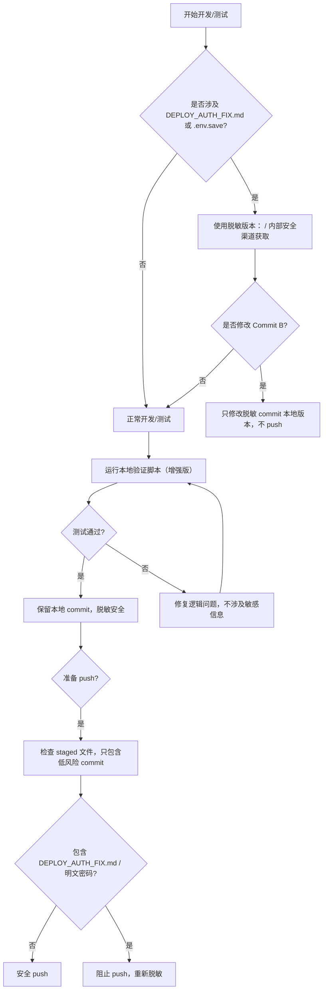

# Finance Suite — 本地开发安全流程

配套规则：`project_finance_suite_security_todo.md`（Claude Memory）

---

## 决策流程图



---

## 本地命令参考

### 保持本地脱敏环境

```bash
# 确保 .env.save 忽略
git check-ignore -v .env.save

# 确认脱敏版本
grep -Ei "PASSWORD|SECRET" DEPLOY_AUTH_FIX.md
```

### 开发与测试

```bash
# 测试监控脚本
python3 ops/monitor_sources.py --json
```

### MCP Server 增强本地验证

脚本路径：

```text
scripts/test_mcp_local_enhanced.py
```

执行命令：

```bash
# 本地运行增强版脚本，生成 Markdown 报告
python3 scripts/test_mcp_local_enhanced.py --format markdown --timeout 0.5

# 生成 HTML 报告
python3 scripts/test_mcp_local_enhanced.py --format html --timeout 0.5
```

报告路径示例：

```text
logs/mcp_local_test_YYYYMMDDTHHMMSSffffff+0000.md
logs/mcp_local_test_YYYYMMDDTHHMMSSffffff+0000.html
```

- Markdown 报告可直接阅读或附入团队文档。
- HTML 报告可在浏览器打开，便于查看每个工具调用成功率、降级层级、异常信息。
- 保持 `<LEAKED_PASSWORD>` / `<PASSWORD>` 占位，历史明文密码不得出现在文档或脚本中。

### 提交低风险改动

```bash
# 只提交安全文件
git add .gitignore ops/monitor_sources.py .env.example requirements.txt
git diff --cached --stat
git commit -m "chore: safe infrastructure files"
```

### 禁止 push（历史清洗前）

```bash
# 确认 staged 文件不含敏感内容
git diff --cached --stat
# git push origin main  ← 暂时不要执行
```

### 历史清洗（计划执行）

```bash
pip install git-filter-repo

# 方案 A：完全删除该文件历史
git filter-repo --path DEPLOY_AUTH_FIX.md --invert-paths

# 方案 B：保留文件演进，仅替换敏感 blob
# 不在 runbook 中提供 Python 回调清洗伪代码。
# 实际命令必须由安全负责人按当时仓库状态单独生成、审查，并在隔离镜像中演练通过。
# 命令生成材料不得进入 git / memory / 公开文档。

# 清洗后 force push
git push --force origin main
```

---

## 职责分工

| 角色 | 职责 |
|---|---|
| C（Claude） | 本地开发/测试，运行增强验证脚本，遵循脱敏规则，不 push 敏感 commit |
| CC（守夜人） | 审查 commit 范围，确认脚本输出安全，阻止明文密码进入 push 流程 |
| 安全负责人（G） | 批准历史清洗、密码轮换、仓库可见性变更 |
